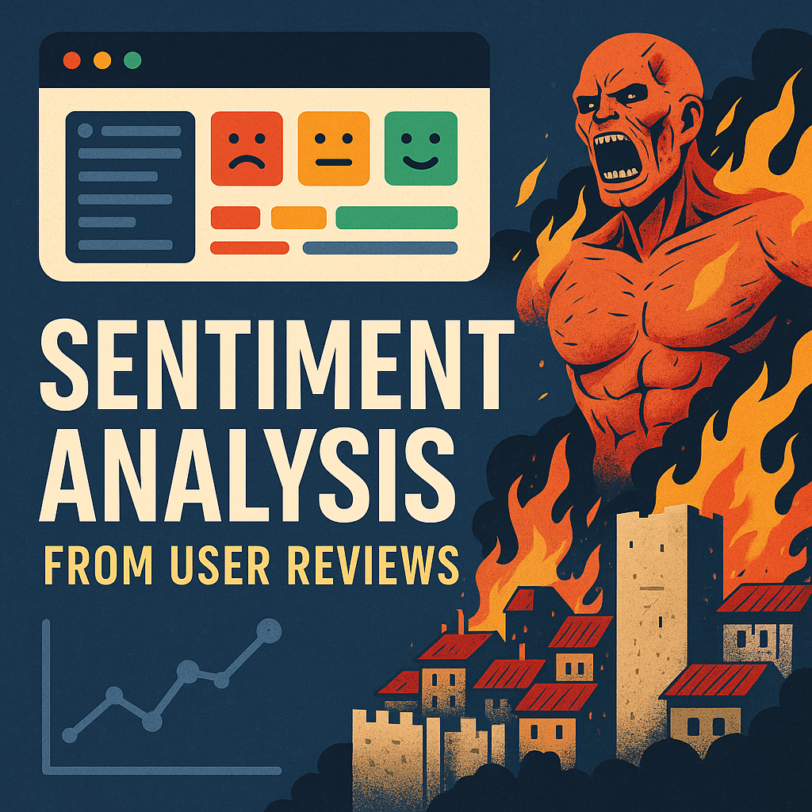

# imdb-sentiment-analysis
Sentiment analysis on IMDB reviews using BERT and web scraping with Selenium

##
This project performs sentiment analysis on IMDb movie reviews using a BERT-based transformer model. Reviews are scraped dynamically using Selenium to handle JavaScript-loaded content, then parsed with BeautifulSoup. Each review is processed through the Hugging Face nlptown/bert-base-multilingual-uncased-sentiment model to generate a sentiment score from 1 (very negative) to 5 (very positive). The results are stored in a Pandas DataFrame for analysis and visualization.

The goal is to demonstrate how to build an end-to-end NLP pipeline that scrapes real-world user data, processes it with a state-of-the-art language model, and returns actionable insights.

